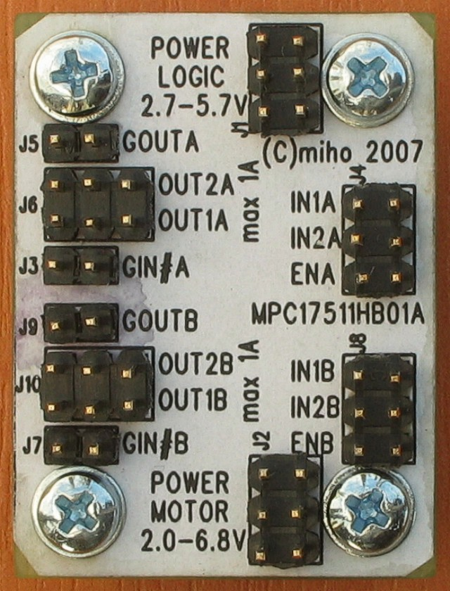
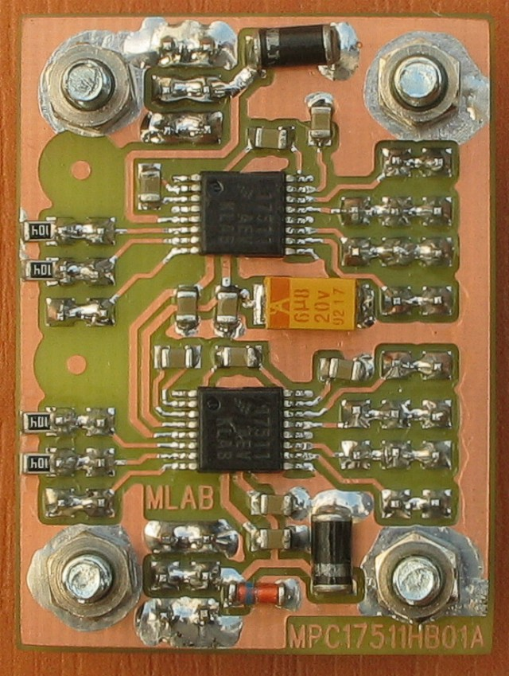

# MPC17511HB01

H‑Bridge motor driver module (2×) using NXP/Freescale **MPC17511A**.

 

## Overview

* Two independent full H‑bridges (U1, U2) for driving **two DC motors**
* Separate supplies for logic (**VDD**) and motor power (**VM**)
* Designed for battery‑powered robots and small mechatronics
* Supports **PWM up to 200 kHz** (modulation on `INx` or `ENx`)

## Electrical specifications

| Parameter                   |               Value | Notes                         |
| --------------------------- | ------------------: | ----------------------------- |
| Motor supply (VM)           |     **2.0 – 6.8 V** | Absolute max 8.0 V            |
| Logic supply (VDD)          |     **2.7 – 5.7 V** | Absolute max 7.0 V            |
| Output current (per bridge) |  **1 A** continuous | Up to **3 A peak**            |
| HS+LS on‑resistance         |   \~**0.45 Ω** typ. | Per bridge path               |
| Logic current               |          ≤ **3 mA** | No load                       |
| PWM frequency               |     **0 – 200 kHz** | DC (static) operation allowed |
| Module size (W×D×H)         | **40 × 30 × 15 mm** | Height over base              |

## Signals & connectors

Each bridge (A/B) exposes the following signals.

* `VM` — Motor supply input (2.0–6.8 V)
* `VDD` — Logic supply input (2.7–5.7 V)
* `PGND`, `LGND` — Power/logic grounds (tie at the module)
* `OUT1x`, `OUT2x` — Motor outputs (channel **x = A/B**)
* `IN1x`, `IN2x` — Direction inputs
* `ENx` — Enable input (can be PWM’d)
* `GIN#`, `GOUT` — Gate‑drive I/O for an **optional external high‑side N‑FET** (not populated on the module)

> Note: The IC separates VM and VDD, allowing direct battery drive for the motor while powering the controller from a regulated VDD.

## Control (functional summary)

* `ENx = H`, `IN1x = H`, `IN2x = L` → **Forward** (`OUT1x = H`, `OUT2x = L`)
* `ENx = H`, `IN1x = L`, `IN2x = H` → **Reverse** (`OUT1x = L`, `OUT2x = H`)
* `ENx = H`, `IN1x = H`, `IN2x = H` → **Brake** (low‑side conduction)
* `ENx = H`, `IN1x = L`, `IN2x = L` → **Coast** (outputs off/high‑Z)
* `ENx = L` → Bridge disabled / low‑power

Refer to the MPC17511A datasheet for the complete truth table and timing.

## Application notes

* **Motor EMI suppression:** Place a **4.7 nF** ceramic directly across the motor terminals. If needed, add small **series chokes** in both motor leads.
* **Power domain isolation:** Keep motor current loops short. Feed the controller from VDD via an **RC/LC filter and regulator**. Star‑connect grounds; join the controller ground to **module ground**, not directly at the battery.
* **Reverse‑polarity & back‑EMF:** Input diodes protect against reversed supply. A **Zener clamp** on VM limits voltage if the motor back‑drives the bridge (e.g., someone spins the motor by hand). Keep VM **< 8 V** at all times.
* **Defined input state:** The IC does **not** include internal pull‑downs on `IN1x/IN2x`. To prevent a floating state at power‑up, populate **100 kΩ** pull‑downs from each `IN1x` and `IN2x` to GND (four resistors total across both bridges).

## Assembly notes

* SMD components are on the **bottom**; pin headers and mechanical hardware are on the **top**.
* Solder fine‑pitch ICs first; use minimal solder and appropriate SMD flux. Diode cathodes and capacitor positive pads are **rounded** in the silkscreen for orientation.

## Typical use

1. Power VDD and VM with current‑limited supplies; slowly raise VM to \~5 V during bring‑up.
2. Drive `IN1x/IN2x/ENx` per the functional summary and verify motor direction and braking.
3. Apply PWM (0–200 kHz) on `INx` or `EN` as required by your control strategy.
